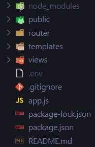

# TripleW es una pagina de recursos para estudiar desarrollo web
Desarrollada con la idea de que sea **OpenSource**, cualquiera puede contribuir sus conocimientos, tips o recursos en las diferentes secciones de la pagina.

# Documentacion para contribuir

### **1. Instalar las dependencias del proyecto.**

Para este proyecto estamos usando [Node](https://nodejs.org), [Express](https://expressjs.com/), [EJS](https://ejs.co/) y [Nodemon](https://www.npmjs.com/package/nodemon)
```javascript
  "dependencies": {
    "ejs": "^3.1.6",
    "express": "^4.17.1",
    "nodemon": "^2.0.12"
  }
```

- Clona el proyecto: <br>
```console
$ git clone https://github.com/lucaspiritogit/triplew
```
- Instala las dependencias: <br>
 ```console
$ npm install
```
- Instala nodemon
```console
$ npm install nodemon
```
> Te recomiendo instalar nodemon de manera global con `npm install -g nodemon`

### El proyecto deberia de verse asi:

> `node_modules` y `.env` no van a estar en tu carpeta local gracias al `.gitignore


### Para correr la aplicación hacer:
'nodemon app' adentro del directorio triplew